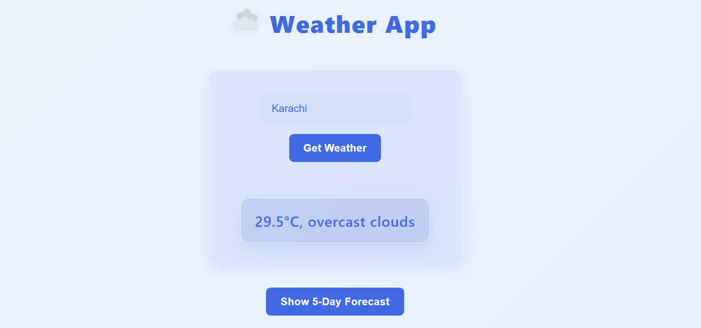

# 🌤️ Weather Vision : Weather Web App

Weather Vision is a sleek and responsive web app that shows real-time weather information for any city using the **OpenWeatherMap API**. Built with **HTML**, **CSS**, and **JavaScript**, it offers a clean sky-themed UI with support for mobile devices.

---

## 🔍 Features

- 🔎 Search weather by city name
- 🌡️ Displays current temperature, condition, and humidity
- 🕒 Shows local time of searched location
- 📱 Fully responsive design
- 🎨 Beautiful gradient background with glassmorphism cards
- ⚙️ Powered by the OpenWeatherMap API

---

## 📸 Preview


---

## 🚀 Tech Stack

- HTML5
- CSS3 (Custom properties, gradients, and glassmorphism)
- JavaScript (Fetch API & DOM manipulation)
- OpenWeatherMap API

---

## 🔧 Getting Started

### 1. Clone the repo

```bash
git clone https://github.com/zain31197/weathervision.git
cd weathervision
